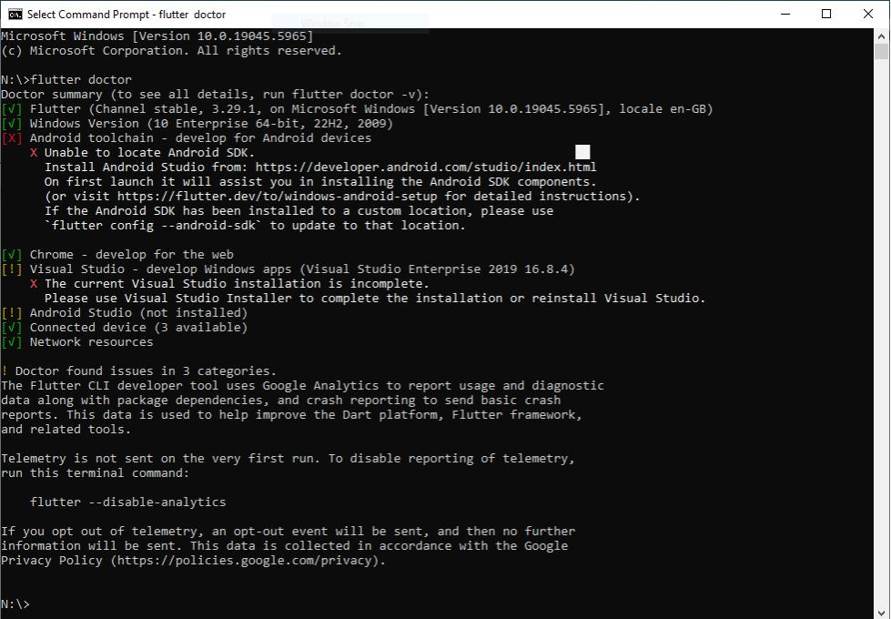
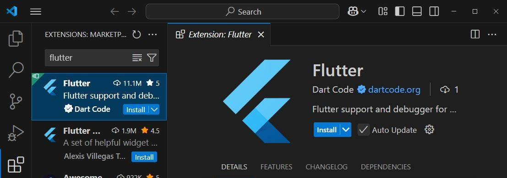
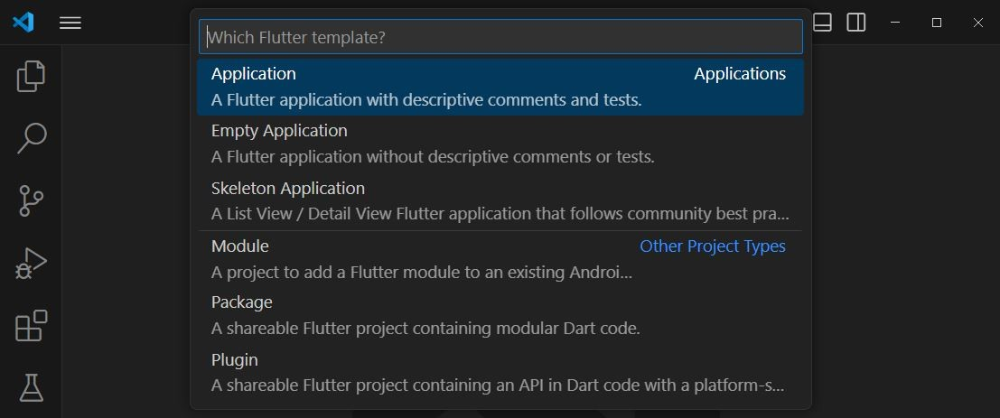
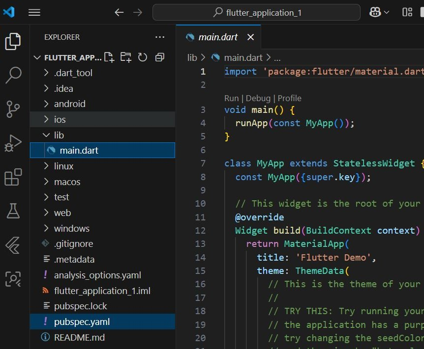
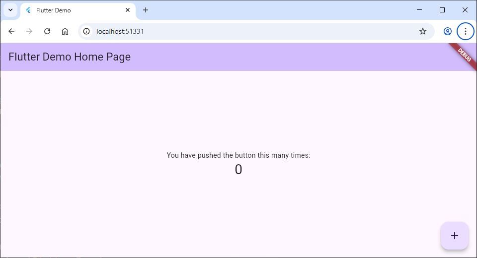
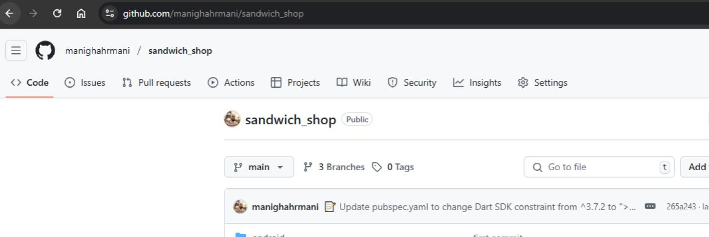
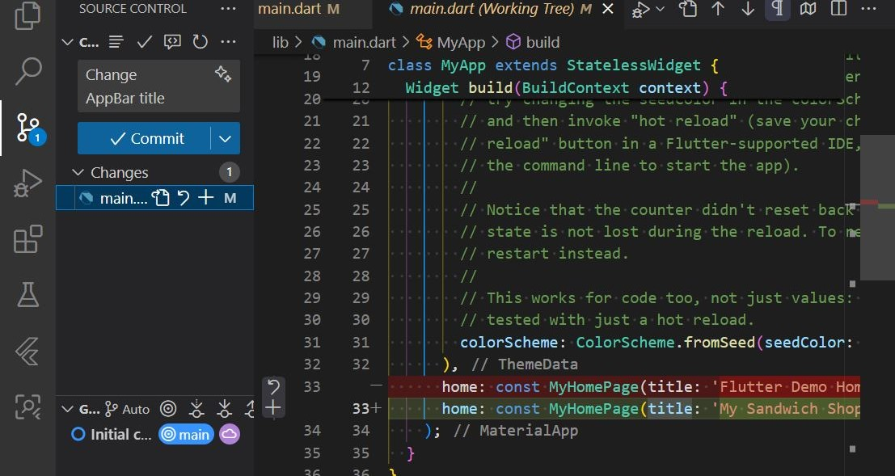

# Worksheet 1 — Introduction to Flutter

## Prerequisites

Ensure that you have already completed the following:

- Introduction to the Dart language.
- Introduction to Git and GitHub.

## Setting Up Your Development Environment

We first need to ensure all the necessary tools are installed on your computer.
You can use either the university computers or your personal Mac or Windows computer.
Skip to the section that matches your operating system.

### University Computers

1. **Log in to AppsAnywhere**

   Use the shortcut on the desktop or head to AppsAnywhere using this link: [appsanywhere.port.ac.uk](https://appsanywhere.port.ac.uk/sso).
   Once you have logged in, you will see a dialogue shown below which you need to first tick the box for "Always allow appsanywhere.port.ac.uk to open links of this type in the associated app" and then click on the "Open AppsAnywhere Launcher" button.

   

1. **Install Git**

   In [AppsAnywhere](https://appsanywhere.port.ac.uk/sso), search for **"Git"** and click on launch.
   Do not select "GitHub Desktop" (see below).

   

   To verify the installation, search for **"Git Bash"** in the Start Menu and open it.
   Use this as the terminal to run the following command and press Enter:

   ```bash
   git --version
   ```

   You should see a version number indicating that Git is installed successfully.

1. **Install the Flutter SDK**

   In [AppsAnywhere](https://appsanywhere.port.ac.uk/sso), search for **"Flutter And Dart SDK"** and click on launch.

   To verify the installation, search for **"Command Prompt"** or **"PowerShell"** in the Start Menu and open it.
   Use this as the terminal to run the following command and press Enter:

   ```bash
   flutter --doctor
   ```

   This may take a while but it should return a report of your Flutter installation status similar to what is shown below:

   

1. **Install and Set Up Visual Studio Code**

   In [AppsAnywhere](https://appsanywhere.port.ac.uk/sso), search for **"Visual Studio Code"** and launch it.

   Next, open [GitHub](https://github.com/) in your web browser and log in to your account.

   Back in Visual Studio Code, click on the Account icon in the bottom left corner and select **"Backup and Sync Settings"** (see below).
   This should automatically sync your settings, themes, and extensions with your GitHub account.

   

   If this is your first time using Visual Studio Code, you need to install the Flutter extension.
   Open the Extensions view by clicking on the Extensions icon in the Activity Bar on the side of the window or by pressing **Ctrl + Shift + X** (Windows) or **⌘ + Shift + X** (macOS).
   In the search bar, type **"Flutter"** and install the extension shown below:

   

### Personal Windows Computer

<!-- Complete this -->

## Your Flutter Application

Now that our environment is set up, we can create our first Flutter project.

1. **Create a New Flutter Project**

   In VS Code, open the Command Palette using **Ctrl + Shift + P** (Windows) or **⌘ + Shift + P** (macOS).
   In the palette, type "Flutter: New Project" and press Enter (see below).

   

   Select **"Application"** when prompted to select a Flutter template and press Enter.
   You will then be prompted to choose a project location and name.
   We recommend your user folder in the C drive.

   Choose a name for your project, such as `sandwich_shop`, and press Enter.
   VS Code will now create a new Flutter project in the specified folder and open it for you.

1. **Understand the Project Structure**

   You should see a new folder structure in the Explorer view on the left side of VS Code (see below).
   You are encouraged to explore and find out what the other files and folders are for, but here are the most important ones:

   - `lib/`: This folder contains the Dart code for your application. The main entry point is `lib/main.dart`.
   - `pubspec.yaml`: This file manages your project's dependencies and assets. It is similar to `package.json` in a Node.js project or `requirements.txt` in a Python project.

   

   The default application created by the Flutter template is a simple counter app.
   `lib/main.dart` contains the following:

   - `void main() => runApp(const MyApp());`: This is the entry point of the app. The `runApp` function takes a `Widget` (`MyApp` in this case) and makes it the top-level widget (the root widget) of the application.
   - `class MyApp extends StatelessWidget`: This is the root widget and remains constant throughout the app's lifecycle. Its main job is to set up the `MaterialApp`, which defines the app's title, theme (colour scheme), and the home screen.
   - `class MyHomePage extends StatefulWidget`: This is the home screen widget. In this app, the counter value is the state that changes.
   - `_incrementCounter()`: This is a method that increments the `_counter` variable when the button is pressed. The call to `setState()` tells the Flutter framework that the state has changed, causing the UI to be updated.
   - `build(BuildContext context)`: This method of `MyHomePage` builds the UI of the widget. It returns a `Scaffold` widget, which provides a basic structure for the app's visual layout, including an `AppBar`, a body with a `Text` widget displaying the counter value, and a `FloatingActionButton` to increment the counter.

   We will learn more about stateless and stateful widgets in later worksheets, this is just a brief overview to get you started.

1. **Select a Target Device**

   At the bottom right of the VS Code window, you'll see a status bar. Click on the device name (it might say "No Device") to open the device selector. For now, choose a browser like **Edge** or **Chrome**.
   You can alternatively set this by opening the Command Palette (**Ctrl + Shift + P** or **⌘ + Shift + P**) and typing "Flutter: Select Device". Then select the browser from the list.

   

1. **Run the App**

   You can run the app in several ways:

   - Press the **F5** key (you may need to press **Fn + F5** on some keyboards).
   - Open the Command Palette (**Ctrl + Shift + P** or **⌘ + Shift + P**) and type "Terminal: Create New Terminal" to open a terminal, then run the following command:

     ```bash
     flutter run
     ```

   - Click the "Run" button that appears above the `main` function in `lib/main.dart`.

   VS Code will now build and run your application.
   Once complete, a browser window should open displaying the counter app.
   Click the `+` button to see the counter increase.

   

1. **Hot Reload**

   One of Flutter's most powerful features is **Hot Reload**.
   You can enable it by clicking the lightning bolt icon in the top right corner of the VS Code window or by pressing **Ctrl + F5** (Windows) or **⌘ + F5** (macOS).
   If you ran the app using the terminal, you can also type `r` in the terminal where the app is running to trigger a hot reload.

   

   While the app is running, try changing the colour scheme from deep purple to orange.
   You can find this in the `lib/main.dart` file, by searching for **"ColorScheme"** (you can use **Ctrl + F** or **⌘ + F** to search).
   Then change `Colors.deepPurple` to `Colors.orange` in the `colorSchemeSeed` property of the `ThemeData` widget.
   You'll see the UI update in the browser almost instantly without the app restarting. This makes development incredibly fast.

## Setting Up a GitHub Repository

Lastly, let's put our project under version control with Git and back it up on GitHub.
This will allow us to track changes and back up our work online.

1. **Initialize the repository**

   In the Activity Bar on the left side of the VS Code window, click on the Source Control icon (it looks like a branch with a dot).
   Click on **"Initialize Repository"** to set up Git for your project as shown below.

   

   Alternatively, you can run the following command in the terminal to initialize Git:

   ```bash
   git init
   ```

1. **Make the First Commit**

   Now you should see all your project files listed in the Source Control panel.
   Hover your mouse over "Changes" and click the `+` icon to stage all files for commit.
   Then, enter a commit message like "Initial commit" in the text box at the top and click the "Commit" button to commit your changes.

   

   Alternatively, you can run the following commands in the terminal:

   ```bash
   git add .
   git commit -m "Initial commit"
   ```

   You may see a pop-up asking you if you would like to stage all changes and commit them directly. You can click "Always" to skip this step in the future.

   The Commit button will now say `Publish Branch` or `Sync Changes`, which means you have committed your changes locally but not yet pushed them to a remote repository (to GitHub).
   Click on this button (or the cloud icon with an arrow on the bottom right corner) to push your changes to GitHub.

   You can do this from the terminal as well by running:

   ```bash
   git push -u origin main
   ```

   You may be asked to allow VS Code to log in to your GitHub account. If so, click on "Allow" and select "GitHub" in the next dialog. This should open your browser to log in to GitHub and authorize VS Code to access your account.

   Next you will be asked to set a name for your GitHub repository. Enter `sandwich_shop` as the name.
   You can choose to make it public or private, for this exercise it doesn't matter but for your coursework you should make it **private**.

   

1. **Verify the Repository on GitHub**

   You can verify this by opening your web browser and navigating to your GitHub account.
   You should see the newly created repository named `sandwich_shop` with all your project files.

   

   The link to the repository should look like this: `https://github.com/YOUR_USERNAME/sandwich_shop` where `YOUR_USERNAME` is your GitHub username.

1. **Make Another Commit**

   Now that you have set up your project and pushed it to GitHub, let's make another commit.
   Open the `lib/main.dart` file and change the text in the `AppBar` widget from `'Flutter Demo Home Page'` to `'My Sandwich Shop'`.
   Save the file (**Ctrl + S** or **⌘ + S**).

   Go back to the Source Control panel, stage the changes, and commit them with a message like **"Change AppBar title"**.
   Remember to always write meaningful commit messages that describe what changes you made.
   The commit message should ideally be written in the imperative mood, like "Add new feature" or "Fix bug".

   Before you click on commit, you can also click on the changed files below the "Changes" section to see the differences (diff) between the current version and the last committed version.

   

   Once you have clicked on commit and then sync changes, you should be able to see the changes to the file in your GitHub repository.

## Exercises

Now it's your turn to experiment. Try to complete the following tasks. Remember to commit your changes after each one.

1.  **Change the Title**: In `lib/main.dart`, find the `AppBar` widget and change its `title` to display "My First App".
2.  **Change the Colour Scheme**: In the `MyApp` widget, find the `ThemeData`. The primary colour is set using `colorSchemeSeed`. Change `Colors.deepPurple` to another colour, like `Colors.teal` or `Colors.amber`. Save and see the app's colours update instantly.
3.  **Add a Reset Button**: In the `MyHomePage` widget, add a new `FloatingActionButton` next to the existing one that resets the counter to `0`.
    - **Hint**: You can wrap the existing `FloatingActionButton` in a `Row` widget to add another button next to it.
    - **Hint**: You'll need to create a new method called `_resetCounter()` that sets the `_counter` to `0` inside a `setState()` call.
4.  **(Advanced) Run on a Mobile Device**: Running on a web browser is great for quick development, but the ultimate goal is often a mobile app. Follow the official documentation to set up your physical phone for Flutter development and run the app on it.
    - [Set up an Android device](https://www.google.com/search?q=https://docs.flutter.dev/get-started/install/windows%23android-setup) (works for Mac/Windows/Linux).
    - [Set up an iOS device](https://www.google.com/search?q=https://docs.flutter.dev/get-started/install/macos%23deploy-to-ios-devices) (requires macOS).
